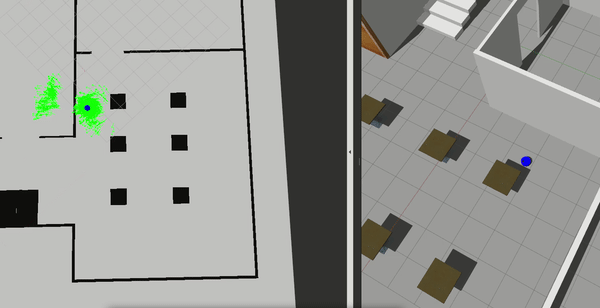

# ROSND Where AM I

## Dependencies for Running Locally
* ``amdl``, ``move_base`` and ``map-server``ROS packages.
  You could install them:(replace <distro> with kinetic, melodic...)
  ``$ sudo apt-get install ros-<distro>-navigation``
  ``$ sudo apt-get install ros-<distro>-map-server``
  ``$ sudo apt-get install ros-<distro>-move-base``
  ``$ sudo apt-get install ros-<distro>-amcl``

## Basic Build Instructions
1. Clone this repo to your work space e.g. c:/home/workspace/
2. cd /home/workspace/Udacity-RoboND-Where-AM-I/
3. catkin_make

## Launch the Project
1. cd /home/workspace/Udacity-RoboND-Where-AM-I/
2. source devel/setup.bash
3. roslaunch main main.launch

## Rviz configuration
A RVIZ configuration is located /Udacity-RoboND-Where-AM-I/amcl.rviz
